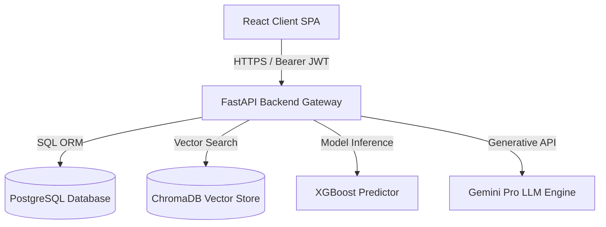
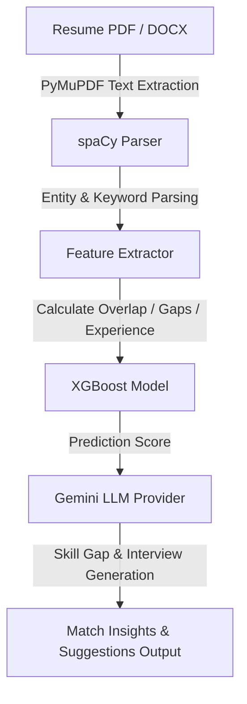
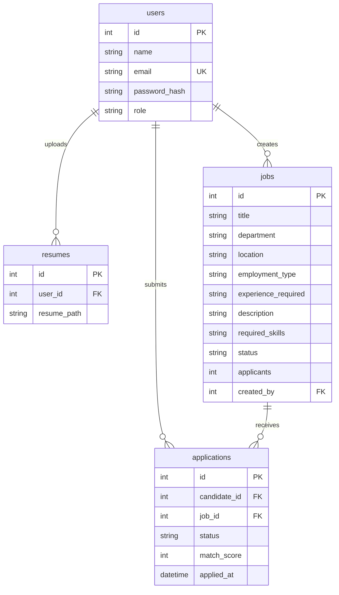

<p align="center">
  
</p>

<h1 align="center">RecruitIQ</h1>

<p align="center">
  <strong>AI-powered recruitment platform that matches candidates to jobs using XGBoost scoring and LLM-based analysis</strong>
</p>

<p align="center">
  
  
  
  
  
  
</p>

<p align="center">
  <a href="#demo">Demo</a> &middot; 
  <a href="#docs">Docs</a> &middot; 
  <a href="#features">Features</a> &middot; 
  <a href="#architecture">Architecture</a> &middot; 
  <a href="#quickstart">Quickstart</a> &middot; 
  <a href="#roadmap">Roadmap</a>
</p>

---

## What is RecruitIQ

RecruitIQ addresses the critical bottleneck in modern HR workflows: scanning hundreds of resumes to find candidates who actually possess the required experience, technical competencies, and role-fit qualifications. By replacing manual screening with a secure, automated data pipeline, RecruitIQ parses PDF/DOCX resumes, maps skills using spaCy, computes compatibility probabilities via a trained XGBoost classifier, and generates contextual interview guides using Gemini Pro. Candidates receive a transparent dashboard to manage their active applications, while HR recruiters get real-time statistics, deep matching insights, and a policy-grounded conversational assistant.

## Why RecruitIQ

RecruitIQ eliminates hiring guesswork. Recruiters can instantly answer questions like:
* *Which candidates possess over 90% technical skill overlap and meet the target experience threshold?*
* *What are the specific technical competency gaps in an applicant's resume compared to our target job description?*
* *What structured interview questions should we ask this specific applicant to verify their self-declared senior-level competencies?*
* *Is our job funnel converting candidates effectively from initial screening to offer stage?*

---

## Features

| Icon | Feature Name | Description |
|:---:|:---|:---|
| 🤖 | **AI Match Scoring** | Classifies and scores candidate compatibility using a custom XGBoost model trained on 7 feature-engineered overlap parameters. |
| 📄 | **Resume Parsing** | Extracts structured fields (skills, education, projects, certifications, history) using spaCy NLP from uploaded PDF/DOCX resumes. |
| 💬 | **RAG HR Assistant** | RAG conversational assistant powered by LangChain and ChromaDB vector store referencing internal corporate policies and guides. |
| 🌐 | **Dual Portal** | Tailored dashboards and interfaces for HR Recruiters (jobs/insights/metrics) and Candidates (job hunting/upload/applications). |
| 📊 | **Application Tracking** | Pipeline workflow to transition applications through Applied, Screening, Interview, and Offer stages. |
| 📈 | **Reports & KPIs** | Live analytics charts and hiring indicators rendering Postgres metrics via Recharts. |
| 🔐 | **RBAC Auth** | Strict stateless JWT authentication with separate route privileges for candidates and HR personnel. |

---

## Architecture

RecruitIQ runs on a decoupled, secure client-server model:



---

## ML Pipeline



---

## Database Schema



---

## Quickstart

### Prerequisite Checklist
* Python 3.11+
* Node.js 18+
* PostgreSQL 15+

### 1. Clone the Repository
```bash
git clone https://github.com/mansi-wagh/RecruitIQ.git
cd RecruitIQ
```

### 2. Backend Setup
```bash
cd backend
python -m venv venv
source venv/Scripts/activate # On Windows: venv\Scripts\activate
pip install -r requirements.txt
```
Create a `.env` file inside the `backend` directory based on the variables below and run:
```bash
python -m uvicorn app.main:app --host 127.0.0.1 --port 8000
```

### 3. Frontend Setup
```bash
cd ../frontend
npm install
```
Create a `.env.local` file inside the `frontend` directory and start the dev server:
```bash
npm run dev
```

### 4. Portals Access
* **Candidate Portal**: Open `http://localhost:5173/` (Login/Register as candidate)
* **HR Portal**: Open `http://localhost:5173/login/hr` (Login/Register as recruiter)

---

## Environment Variables

### Backend (`backend/.env`)
| Variable | Required | Description |
|:---|:---:|:---|
| `DATABASE_URL` | Yes | Connection string for PostgreSQL database |
| `SECRET_KEY` | Yes | Secure string key to sign JWT tokens |
| `ALGORITHM` | Yes | Hashing algorithm used (default: `HS256`) |
| `ACCESS_TOKEN_EXPIRE_MINUTES` | Yes | Validity lifetime of the issued JWT token |
| `GEMINI_API_KEY` | Yes | API Key to request Gemini LLM completions |

### Frontend (`frontend/.env.local`)
| Variable | Required | Description |
|:---|:---:|:---|
| `VITE_API_URL` | Yes | Root URL of the FastAPI backend (e.g. `http://localhost:8000`) |

---

## Project Structure

```text
RecruitIQ/
├── backend/
│   ├── app/
│   │   ├── auth/         # JWT handler and security dependencies
│   │   ├── models/       # SQLAlchemy tables definitions
│   │   ├── schemas/      # Pydantic validation schemas
│   │   ├── routers/      # API endpoints (jobs, resume, ai, assistant)
│   │   ├── services/     # NLP parsers, ML matching engines, LLM provider
│   │   ├── rag/          # ChromaDB and retriever bootstrapping pipelines
│   │   └── database.py   # Connection setup
│   └── requirements.txt  # Python environment packages
└── frontend/
    ├── src/
    │   ├── components/   # Sidebar layouts and UI design elements
    │   ├── lib/          # Global Axios clients
    │   ├── routes/       # TanStack portal routing components
    │   └── main.tsx      # Application root mount
    └── package.json      # Node dependency registry
```

---

## API Reference

| Method | Endpoint | Auth | Description |
|:---:|:---|:---:|:---|
| `POST` | `/auth/register` | Public | Registers a new user account (HR or Candidate) |
| `POST` | `/auth/login` | Public | Authenticates credentials and returns a JWT token |
| `GET` | `/auth/me` | JWT | Retrieves the current logged-in user profile |
| `PUT` | `/auth/me` | JWT | Updates user credentials and password securely |
| `GET` | `/jobs` | JWT | Lists all jobs stored in the PostgreSQL database |
| `POST` | `/jobs` | HR Role | Creates a new job posting |
| `POST` | `/resume/upload` | JWT | Uploads candidate resume PDF/DOCX to storage |
| `POST` | `/resume/extract` | JWT | Triggers spaCy extraction on uploaded resume |
| `GET` | `/ai/resumes` | HR Role | Fetches all candidates with uploaded resumes |
| `POST` | `/ai/analyze` | HR Role | Evaluates candidate resume against job requirements |
| `POST` | `/assistant/chat` | HR Role | Queries policy documents in ChromaDB |

---

## Screenshots

<p align="center">
  <strong>HR Recruiter Dashboard</strong><br/>
  
</p>

<p align="center">
  <strong>AI Matching & Analysis Insights</strong><br/>
  
</p>

<p align="center">
  <strong>Candidate Application Feed</strong><br/>
  
</p>

<p align="center">
  <strong>Policy-Grounded HR Chat Assistant</strong><br/>
  
</p>

---

## Roadmap

* [x] **Available Now**
  * PostgreSQL integration for all application tracking models.
  * Stateless JWT authentication flow guarding all private resources.
  * Auto-bootstrapping vector store query search for policy questions.
  * Recruiter charts rendering real database stats metrics.
* [ ] **Next**
  * Multiple resume uploads with active profile parsing.
  * PDF report exports for candidates matching metrics.
* [ ] **Later**
  * Automatic scheduling integrations for calendar screens.
  * Candidate email notification sequences on screening status updates.


---

## License

This project is licensed under the MIT License — see the [LICENSE](LICENSE) file for details.