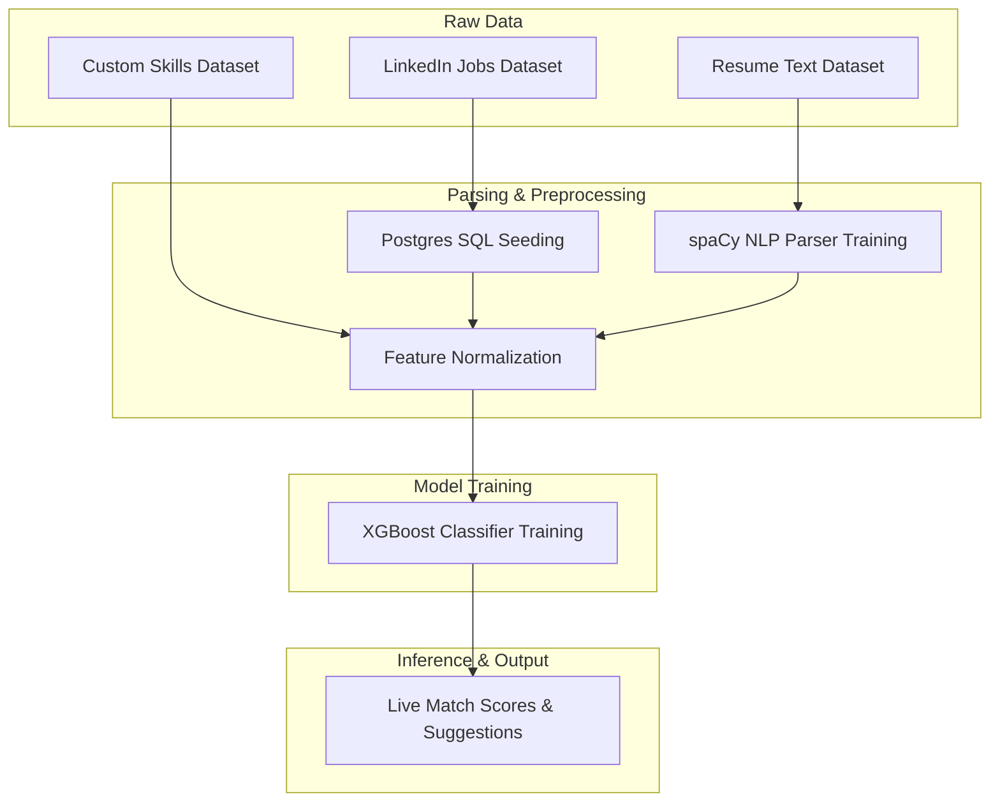

# Dataset Summary

Documentation of datasets used in RecruitIQ for training NLP parsing layers, feature extractors, RAG references, and the XGBoost candidate matching classifier.

---

## Overview

| Dataset Name | Source | Format | Size | Purpose |
|:---|:---|:---:|:---|:---|
| **LinkedIn Job Postings (2023–2024)** | Kaggle | CSV | 2023–2024 (15,000+ entries) | Generates initial job listing metrics & profiles in PostgreSQL |
| **Resume Classification Dataset** | Kaggle | CSV | 2,400+ entries | Trains spaCy model and extracts text elements |
| **Custom Skills Matching Dataset** | Self-Created | CSV | 1,000+ entries | Trains the XGBoost candidate matching classifier |

---

## Individual Dataset Details

### 1. LinkedIn Job Postings (2023–2024)
* **Source & Link**: [Kaggle — LinkedIn Job Postings](https://www.kaggle.com/datasets/arshkon/linkedin-job-postings)
* **License**: Public Domain (CC0)
* **Description**: A comprehensive collection of job postings listed on LinkedIn covering various regions, experience requirements, salaries, and company dimensions.
* **Key Fields Used**:
  * `job_id`: Unique identifier mapped to PostgreSQL primary keys.
  * `title`: Mapped to job title definitions.
  * `description`: Used to extract core duties, technology stacks, and responsibilities.
  * `required_skills`: Parsed to map skills list.
  * `experience_level`: Mapped to job eligibility experience requirements.
* **Preprocessing**: Cleaned HTML tags and emojis from job description fields, extracted skill abbreviations, converted experience levels to integer values (years required), and loaded them directly to PostgreSQL tables using seed scripts.
* **Component Usage**: Used to populate the **PostgreSQL Jobs Table** and supply job attributes for similarity matching during candidate evaluation.

---

### 2. Resume Classification Dataset for NLP
* **Source & Link**: [Kaggle — Resume Classification Dataset for NLP](https://www.kaggle.com/datasets/hassnainzaidi/resume-classification-dataset-for-nlp)
* **License**: Open Database License (ODbL)
* **Description**: Pre-categorized dataset containing resume texts across various domains such as Technology, Finance, Human Resources, and Engineering.
* **Key Fields Used**:
  * `resume_text`: Raw extracted text from applicant resumes.
  * `category` / `label`: Applied tag designating their professional domain.
* **Preprocessing**: Applied tokenization, lowercasing, stop-word removal, and POS tagging to normalize the text body before training.
* **Component Usage**: Trains the custom **spaCy NLP Entity Extractor** to identify tech stack tokens, certifications, years of experience, and degree levels.

---

### 3. Custom Skills Matching Dataset (Self-Created)
* **Created By**: Mansi Wagh (Project Author)
* **License**: Proprietary / Portfolio Custom License
* **Description**: A curated dataset containing synthetic and real-world paired vectors representing job description parameters matched against candidate resume profiles.
* **Key Fields Used**: Mapped into 7 distinct numerical features and a target label (`match`).
* **Preprocessing**: Formulated by executing candidate resumes against jobs, calculating the difference vectors, and normalizing each score between 0 and 1.
* **Component Usage**: Trains the core **XGBoost Classifier Model** (`xgboost_model.pkl`) to output binary match likelihood indices.

---

## Data Pipeline



---

## Custom Dataset Schema

This dataset contains **1,000+ entries** tracking applicant suitability metrics across 7 features:

| Column Name | Type | Value Range | Description |
|:---|:---:|:---:|:---|
| `matched_skill_count` | `int` | `0 – 50` | Total number of candidate skills matching the job posting |
| `missing_skill_count` | `int` | `0 – 50` | Total number of required job skills not found in candidate resume |
| `experience_gap` | `int` | `-10 – 10` | The difference in years between job requirement and candidate experience |
| `education_gap` | `int` | `0 – 2` | Calculated degree mismatch indicator (`0` = fits/exceeds, `1` = minor gap, `2` = mismatch) |
| `retrieval_score` | `float` | `0.0 – 1.0` | Dense vector embedding cosine similarity score |
| `technical_job_score` | `float` | `0.0 – 1.0` | Matching score calculated solely on technical hard-skills overlap |
| `jaccard_similarity` | `float` | `0.0 – 1.0` | Intersection over union overlap calculation on vocabulary tokens |
| `match` (Target Label) | `int` | `0` or `1` | Evaluation outcome (`1` = Match / Shortlist, `0` = No Match) |

---

## Usage & Reproduction

### 1. Kaggle Datasets Download
To reproduce the initial state of the SQL databases:
1. Download the LinkedIn dataset zip from [Kaggle](https://www.kaggle.com/datasets/arshkon/linkedin-job-postings) and extract it.
2. Download the resume dataset from [Kaggle](https://www.kaggle.com/datasets/hassnainzaidi/resume-classification-dataset-for-nlp).
3. Place files in `backend/app/data/` or equivalent folders mapped in seed scripts.

### 2. Custom Dataset Integration
* The self-created training metrics file is already checked in and hosted at:
  [`backend/app/data/skills.csv`](file:///d:/Projects/RecruitIQ/backend/app/data/skills.csv)

---

## Citation & Hybrid Dataset Creation

### Academic Citations
```text
@misc{linkedin_jobs_2024,
  title = {LinkedIn Job Postings Dataset (2023-2024)},
  year = {2024},
  publisher = {Kaggle},
}

@misc{resume_nlp_2023,
  title = {Resume Classification Dataset for NLP},
  year = {2023},
  publisher = {Kaggle},

}
```

### Hybrid Dataset Creation & Corporate Policies RAG
To evaluate the RAG assistant accurately, a hybrid database approach was formulated:
1. **Candidate Profiling**: Natural profiles were structured from the Kaggle Resume NLP entries.
2. **Organizational Rules Integration**: Custom policy guidelines covering hiring stages, technical thresholds, probation terms, and interview matrices were written to represent real-world corporate policies.
3. **Synthesis**: The resultant dataset fuses objective resume metrics with company-specific assessment rules, enabling the RAG system to score candidate profiles against internal organizational guidelines.
